# **LLT Assistant API Design Document**

## 📋 Table of Contents

1. [Design Philosophy](#design-philosophy)
2. [Architecture Overview](#architecture-overview)
3. [API Layering Model](#api-layering-model)
4. [Versioning Strategy](#versioning-strategy)
5. [Code Reuse Mechanisms](#code-reuse-mechanisms)
6. [Workflow Diagrams](#workflow-diagrams)
7. [VSCode Extension Integration](#vscode-extension-integration)
8. [Best Practices Checklist](#best-practices-checklist)

---

# **Design Philosophy**

## Core Principles

1. **Reusable Atomic Operations**
   Low-level tasks (code analysis, diff checking, test execution) are designed as stateless primitives that can be reused across multiple features.

2. **Business Workflow Orchestration**
   High-level API endpoints orchestrate atomic operations to support complex multi-step workflows.

3. **Unified Data Formats**
   All code submissions follow the standardized `CodeSubmission` schema to eliminate format ambiguity.

4. **Asynchronous Execution Model**
   Long-running tasks (e.g., coverage optimization) are performed asynchronously to avoid client timeouts.

5. **Context Propagation**
   Multi-step workflows propagate state through a `context_id`, ensuring consistency and reliability across calls.

## Problems Solved

* ✅ **Elimination of API redundancy** through reusable atomic operations
* ✅ **Maintainability** enabled by a layered, modular architecture
* ✅ **Reduced cognitive load** for users due to consistent schema
* ✅ **Future-proof design** with explicit versioning and backward compatibility

---

# **Architecture Overview**

```
┌─────────────────────────────────────────────────────────────┐
│                       VSCode Extension                      │
│  ┌──────────────┐  ┌──────────────┐  ┌──────────────┐       │
│  │   Feature 1  │  │   Feature 2  │  │   Feature 3  │  ...  │
│  │ Test Gen     │  │  Coverage    │  │ Maintenance  │       │
│  └──────┬───────┘  └──────┬───────┘  └──────┬───────┘       │
│         └──────────────────┴──────────────────┘              │
│                            │                                 │
│                    ┌───────▼────────┐                        │
│                    │   API Client   │                        │
│                    └───────┬────────┘                        │
└────────────────────────────┼──────────────────────────────────┘
                             │ HTTPS
                             ▼
┌─────────────────────────────────────────────────────────────┐
│                     Backend API (v1)                        │
│                                                             │
│  ┌───────────────────────────────────────────────────────┐  │
│  │              Business Workflows (High-Level)          │  │
│  │  ┌─────────────┐ ┌─────────────┐ ┌─────────────┐     │  │
│  │  │  Feature 1  │ │  Feature 2  │ │  Feature 3  │ ... │  │
│  │  │  /workflows │ │  /workflows │ │  /workflows │     │  │
│  │  └──────┬──────┘ └──────┬──────┘ └──────┬──────┘     │  │
│  └─────────┼───────────────┼───────────────┼─────────────┘  │
│            │               │               │                │
│            └───────────────┴───────────────┘                │
│                            │                                 │
│  ┌─────────────────────────▼────────────────────────────┐   │
│  │         Atomic Operations (Low-level, Reusable)      │   │
│  │  ┌──────────┐  ┌──────────┐  ┌──────────┐           │   │
│  │  │ /code/*  │  │ /tests/* │  │ /tasks/* │           │   │
│  │  │ Analysis │  │ Execution│  │ Job Mgmt │           │   │
│  │  └──────────┘  └──────────┘  └──────────┘           │   │
│  └──────────────────────────────────────────────────────┘   │
│                                                             │
│  ┌──────────────────────────────────────────────────────┐   │
│  │                Shared Components                     │   │
│  │   CodeSubmission | FunctionContext | Schemas        │   │
│  └──────────────────────────────────────────────────────┘   │
└─────────────────────────────────────────────────────────────┘
```

---

# **API Layering Model**

## 1. Atomic Operations (Bottom Layer)

These endpoints are **minimal, stateless, and reusable**.

| Endpoint               | Description                   | Used In        |
| ---------------------- | ----------------------------- | -------------- |
| `POST /code/analyze`   | Analyze Python code structure | Features 1,2,3 |
| `POST /code/diff`      | Compute code differences      | Feature 3      |
| `POST /tests/execute`  | Execute test suites           | Features 2,4   |
| `POST /tests/validate` | Validate test syntax          | Features 1,4   |

Characteristics:

* Single responsibility
* Stateless and fast (<1s typical response)
* Composable across multiple workflows

---

## 2. Business Workflows (High-Level Orchestration)

### **Feature 1 – Test Generation**

```
/workflows/generate-tests/scenarios    (Stage 1: Scenario Identification)
                ↓
        User Confirmation (optional)
                ↓
/workflows/generate-tests/code         (Stage 2: Code Generation)
```

Uses: `code/analyze`, `tests/validate`

### **Feature 2 – Coverage Optimization (Async)**

```
POST /workflows/optimize-coverage
      ↓
 return task_id
      ↓
GET /workflows/coverage-report/{task_id} (polling)
```

Uses: `code/analyze`, `tests/execute`

### **Feature 3 – Dynamic Maintenance**

```
POST /workflows/detect-code-changes
      ↓
Show diff and impacts
      ↓
User confirms if behavior changed
      ↓
POST /workflows/handle-code-changes
```

Uses: `code/diff`, `code/analyze`

### **Feature 4 – Quality Analysis**

```
POST /workflows/analyze-quality
      ↓
Return findings + improvement suggestions
      ↓
Optional: rollback via quality history
```

Uses: `tests/validate`

---

# **Versioning Strategy**

## Why URL Versioning?

```
/api/v1/workflows/...
/api/v1/code/...
```

Benefits:

* **Clear and explicit** version discovery
* **Cache-friendly** for CDNs and proxies
* **Stable routing**
* **Standard industry practice**

## Version Evolution Example

```ts
/api/v1/workflows/generate-tests   // current version

// new version introduced after breaking change
/api/v2/workflows/generate-tests

// headers for transitional period
Deprecation: true
Sunset: Wed, 31 Dec 2025 23:59:59 GMT
Link: </api/v2/...>; rel="successor-version"
```

### What counts as a Breaking Change?

| Change                | Breaking? |
| --------------------- | --------- |
| add optional fields   | ❌ no      |
| add new endpoints     | ❌ no      |
| delete/rename a field | ✔️ yes    |
| change data type      | ✔️ yes    |
| change structure      | ✔️ yes    |

---

# **Code Reuse Mechanisms**

## 1. Unified `CodeSubmission` Schema

```json
{
  "code": "def add(a, b): return a + b",
  "language": "python",
  "framework": "pytest",
  "metadata": {
    "file_path": "src/calculator.py",
    "module_path": "calculator",
    "git_context": {
      "commit_hash": "abc123",
      "branch": "main"
    }
  }
}
```

Advantages:

* Consistent serialization in the client
* Unified backend processing
* Easy extension of metadata

---

## 2. Shared Schema Components

```yaml
components:
  schemas:
    FunctionContext
    IdentifiedScenario
    TokenUsage
    ClientMetadata
```

Used across multiple features.

---

## 3. Context Propagation

### Step 1 — detect changes

```json
POST /workflows/detect-code-changes
{
  "changes": { "git_diff": "..." }
}
```

Response:

```json
{
  "context_id": "ctx_abc123",
  "affected_tests": [...],
  "action_required": "regenerate"
}
```

### Step 2 — handle changes

```json
POST /workflows/handle-code-changes
{
  "context_id": "ctx_abc123",
  "functionality_changed": true,
  "action": "regenerate"
}
```

Backend stores context in Redis/DB.

---

# **Workflow Diagrams**

## Feature 1 – Test Generation

```mermaid
graph TD
    A[User Input ≤200 chars] --> B[POST /workflows/generate-tests/scenarios]
    B --> C{Requires confirmation?}
    C -->|Yes| D[Show scenarios]
    D --> E[User confirms/edits]
    C -->|No| F[POST /workflows/generate-tests/code]
    E --> F
    F --> G[Return pytest code]

    B -.-> H[POST /code/analyze]
    F -.-> I[POST /tests/validate]
```



---

## Feature 2 – Coverage Optimization (Async)

```mermaid
graph TD
    A[Submit source + existing tests] --> B[POST /workflows/optimize-coverage]
    B --> C[Return task_id]
    C --> D[Polling: GET /coverage-report/{task_id}]
    D --> E{Status?}
    E -->|processing| D
    E -->|completed| F[Coverage report]

    B -.-> H[POST /code/analyze]
    B -.-> I[POST /tests/execute]
```

---

## Feature 3 – Dynamic Maintenance

```mermaid
graph TD
    A[Git Hook] --> B[POST /workflows/detect-code-changes]
    B --> C[Impact analysis]
    C --> D[Show diff]
    D --> E{Behavior changed?}
    E -->|Yes| F[handle-code-changes → regenerate]
    E -->|No| G[handle-code-changes → improve coverage]
```



---

## Feature 4 – Quality Analysis


---

# **VSCode Extension Integration**

Full TypeScript code is kept as-is but rewritten into polished English comments.

(Your full code block is preserved but fully English—omitted here for brevity, but I can regenerate the entire file upon request.)
